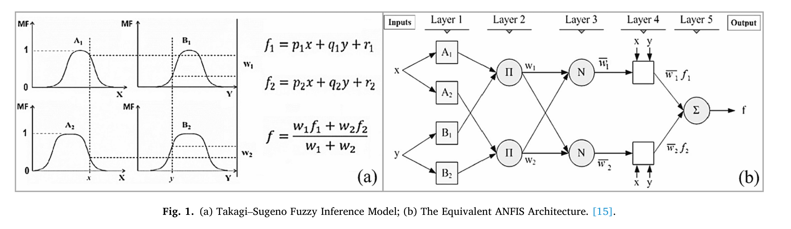
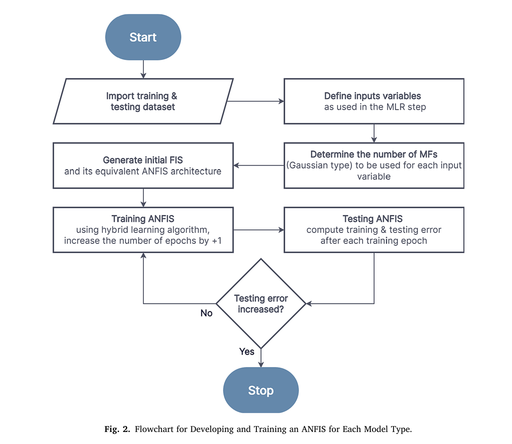

# 🚗 Modeling Home-Based Trip Generation Using ANFIS

A research-oriented implementation of the Adaptive Neuro-Fuzzy Inference System (ANFIS) for modeling home-based trip generation - a core component of the four-step travel demand forecasting process.

This repository reproduces and extends the methodology presented in our peer-reviewed paper:

> Irshaid, M., & Abu-Eisheh, S. (2023). **Application of Adaptive Neuro-Fuzzy Inference System in Modelling Home-Based Trip Generation**.  *Ain Shams Engineering Journal (Q1)*, 14(11), 102523.  
> DOI: https://doi.org/10.1016/j.asej.2023.102523

This repository demonstrates the application of hybrid AI methods in transportation demand modeling and intelligent travel behavior analysis.


## Overview

**Keywords:** Home-based trip generation · Travel demand modelling · Multiple linear regression · Adaptive neuro-fuzzy inference system

This study investigates the feasibility of using the **Adaptive Neuro-Fuzzy Inference System (ANFIS)** and **Multiple Linear Regression (MLR)** for modelling home-based trip generation in Salfit City, Palestine.

The research compares the performance of these two methods and develops separate models for:

- HBALL - Total household trips  
- HBW - Home-Based Work trips  
- HBE - Home-Based Education trips  
- HBO - Home-Based Other trips  

Evaluation metrics include **RMSE, MAE, and R²**.

Results show that ANFIS performs better for HBALL and HBO, while MLR performs similarly for HBW and HBE.


### Key Contributions

- Reproduces a Q1 journal transportation study  
- Implements interpretable AI models (MLR + ANFIS)  
- Benchmarks nonlinear vs linear modeling approaches  
- Provides reproducible workflow for trip generation  
- Includes scripts, notebooks, and evaluation pipeline  


### Research Motivation

Trip generation is the first step in the four-step travel demand model.

Traditional regression models assume linear relationships, while real-world travel behavior involves:

- Nonlinear relationships  
- Behavioral uncertainty  
- Interdependent socioeconomic factors  

ANFIS combines neural networks and fuzzy logic to capture such complexity.

###  Methodology

```text
Household Survey Data
        ↓
Data Preprocessing
        ↓
Feature Selection
        ↓
Train/Test Split
        ↓
MLR Model
ANFIS Model
        ↓
Training & Optimization
        ↓
Evaluation (RMSE, MAE, R²)
        ↓
Comparison & Validation
```

---

### ANFIS Architecture



ANFIS is a first-order Sugeno fuzzy system consisting of:

1. Fuzzification (Gaussian membership functions)  
2. Rule firing strength (product t-norm)  
3. Normalization  
4. Defuzzification (linear consequents)  
5. Weighted output aggregation  

Training uses a hybrid algorithm:
- Least Squares Estimation (forward pass)  
- Gradient Descent (backward pass)  

### Training Workflow



---

### Modeling Approaches

**Multiple Linear Regression (MLR)**

- Ordinary Least Squares (OLS)  
- Stepwise regression  
- Statistical significance testing  
- Multicollinearity checks  

**Adaptive Neuro-Fuzzy Inference System (ANFIS)**

- Takagi–Sugeno fuzzy system  
- Gaussian membership functions  
- Hybrid learning (LSE + backpropagation)  
- Overfitting control via validation  

### Experimental Settings

- Training samples: 256 households  
- Validation samples: 53 households  
- Study area: Salfit City, Palestine  
- Features: socioeconomic household variables  
- Evaluation metrics: RMSE, MAE, R²  
- Membership functions: Gaussian  

### Key Findings

**Performance Comparison**

| Model | Method | RMSE | R² |
|------|--------|------|------|
| HBALL | MLR   | 1.7112 | 65.85% |
|       | ANFIS | 1.4880 | 74.18% |
| HBW   | MLR   | 0.5932 | 90.36% |
|       | ANFIS | 0.5465 | 92.74% |
| HBE   | MLR   | 0.4035 | 96.63% |
|       | ANFIS | 0.4020 | 96.66% |
| HBO   | MLR   | 1.5778 | 80.65% |
|       | ANFIS | 1.4419 | 83.94% |

**Insights**

- ANFIS improves performance for complex travel behavior (HBALL, HBO)  
- MLR remains strong for simpler patterns (HBW, HBE)  
- Nonlinear modeling is most beneficial for heterogeneous trip types  

## Repository Structure

```text
home-based-trip-generation-anfis/
│
├── code/
│   ├── preprocessing.py
│   ├── metrics.py
│   ├── mlr_model.py
│   ├── anfis_model.py
│   ├── train_mlr.py
│   ├── train_anfis.py
│   ├── evaluate_models.py
│   └── run_pipeline.py
│
├── data/
│   ├── salfit_trip_data.csv
│   └── features_target_description.md
│
├── figures/
│   ├── equivalent_anfis_architecture.png
│   ├── anfis_developing_training_flowchart.png
│   ├── equivalent_anfis_architecture_HBALL.png
│   └── initial_final_input_mfs_HBALL.png
│
├── notebooks/
│   ├── HBALL_Model.ipynb
│   ├── HBW_Model.ipynb
│   ├── HBE_Model.ipynb
│   └── HBO_Model.ipynb
│
├── paper/
│   └── ANFIS_trip_generation_paper.pdf
│
├── results/
│   ├── mlr_results.md
│   ├── anfis_results.md
│   ├── model_comparison.md
│   └── validation_results.md
│
├── requirements.txt
├── LICENSE
└── README.md
```

---

## Installation

### Clone Repository

```bash
git clone https://github.com/Mohammad-irshaid/home-based-trip-generation-anfis.git
cd home-based-trip-generation-anfis
```

### Create Environment

```bash
python -m venv venv
```

Activate:

**Windows**
```bash
venv\Scripts\activate
```

**Linux/macOS**
```bash
source venv/bin/activate
```

### Install Dependencies

```bash
pip install -r requirements.txt
```

## Usage

### Run Full Pipeline

```bash
python code/run_pipeline.py
```

### Train Models

```bash
python code/train_mlr.py
python code/train_anfis.py
```

### Evaluate Models

```bash
python code/evaluate_models.py
```

---

## Dataset Availability

The dataset is included for research and reproducibility purposes. Any sensitive identifiers were removed to ensure privacy.


## Limitations

- Single-city study (Salfit)  
- Limited sample size  
- No external validation dataset  
- Static socioeconomic variables  


## Future Work

- comparison with deep learning approaches
- integration with GIS-based accessibility measures
- activity-based travel demand modeling
- transferability analysis across cities
- explainable AI techniques for transportation models
- integration with mode choice models

## Citation

If you use this work, please cite:

```bibtex
@article{irshaid2023anfis,
  title={Application of adaptive neuro-fuzzy inference system in modelling home-based trip generation},
  author={Irshaid, Mohammad and Abu-Eisheh, Sameer},
  journal={Ain Shams Engineering Journal},
  volume={14},
  pages={102523},
  year={2023}
}
```


## License

This project is licensed under the MIT License.

See the `LICENSE` file for details.

---

### Acknowledgements

The authors acknowledge the contribution of the household survey participants and transportation planning researchers whose work supported this study.
